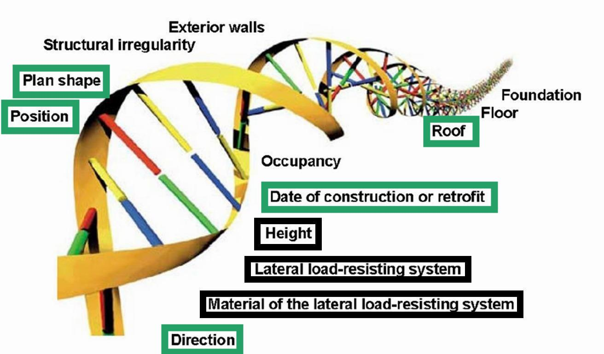
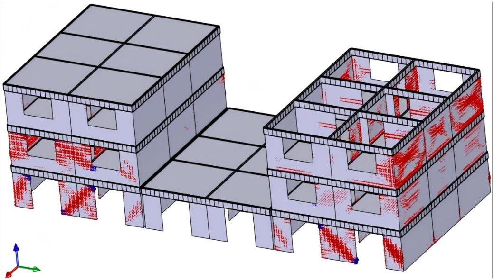
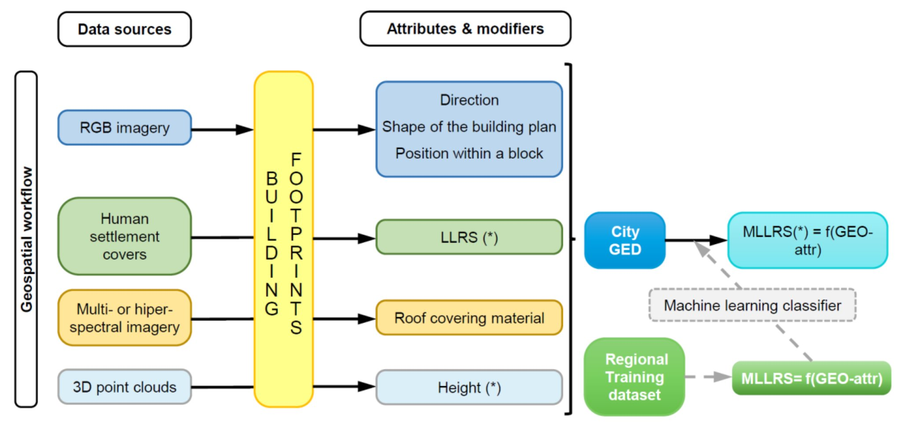
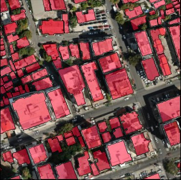
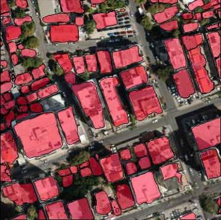
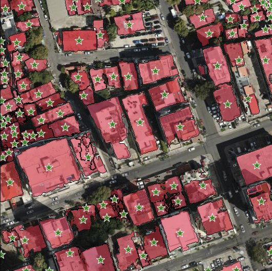
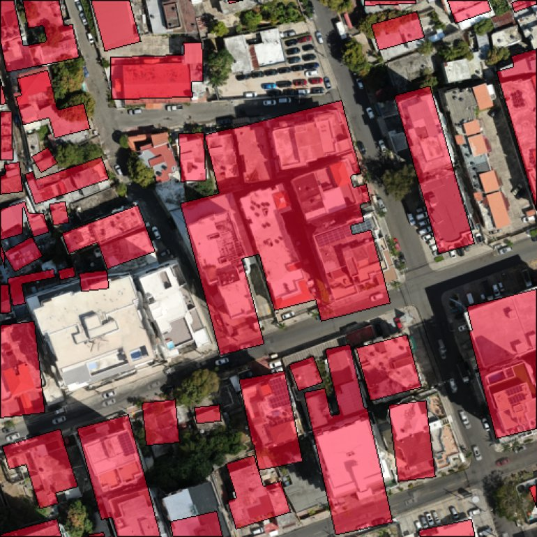
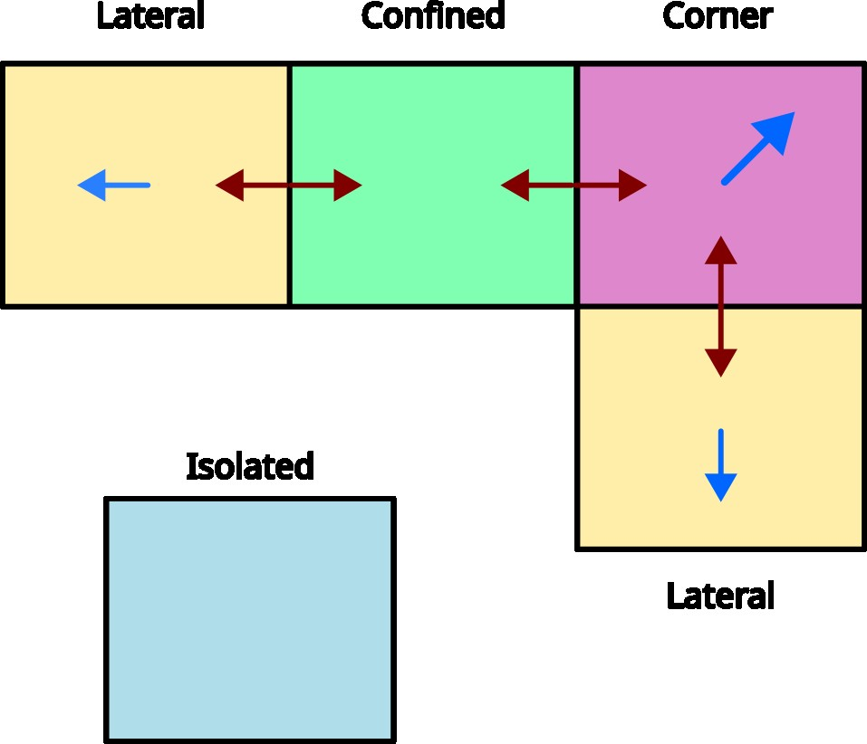
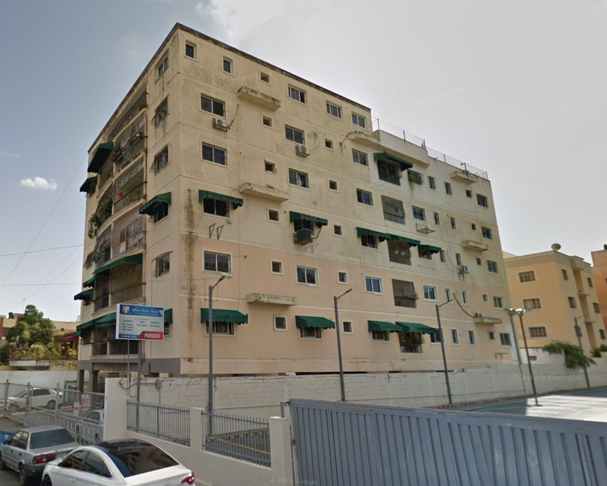
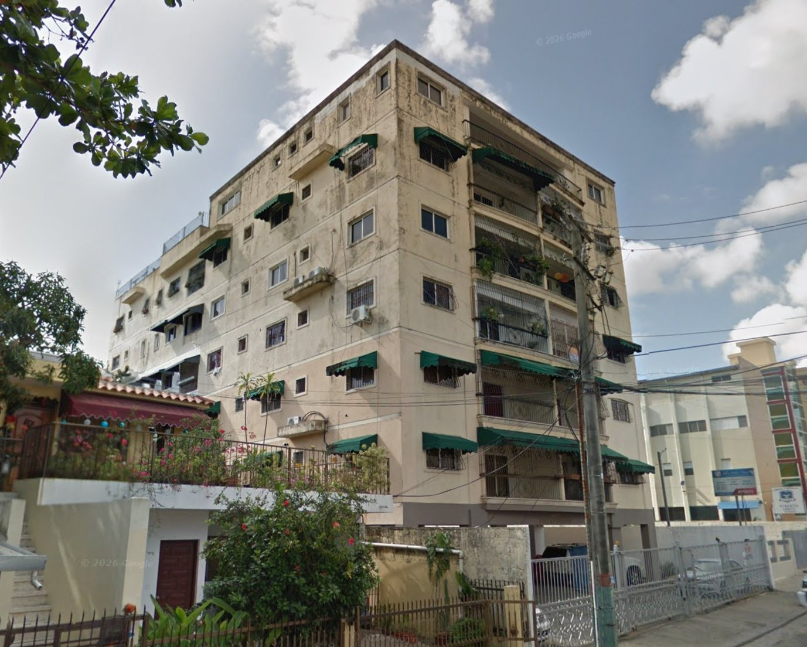

<!-- _class: title -->
<!-- _paginate: false -->
<!-- _header: '' -->

<!-- Optional faded background map. Delete these two lines to turn it off. -->
<!-- MAP:title_bg -->

# Machine learning classification of structural systems using exclusively geospatial and remote sensing attributes: A case study in Santo Domingo, Dominican Republic

Miguel Ureña-Pliego1,*, Javier Rodríguez-Saiz1,2, Javier Sempere-Hernández3, Beatriz Moya-García4,5, Sebastián Rodríguez-Iturra5, Francisco Chinesta4,5, Beatriz González-Rodrigo6, Miguel Marchamalo-Sacristán1,7

1 Departamento de Ingeniería y Morfología del Terreno, ETSICCP, Universidad Politécnica de Madrid, Spain
2 Buin Ingenieros, S.L. Madrid, Spain
3 Facultad de Ciencias, Universidad Nacional de Educación a Distancia, Spain
4 CNRS@CREATE LTD., Singapore
5 ENSAM Institute of Technology, Paris, France
6 Departamento de Ingeniería y Gestión Forestal, ETSIMFYMN, Universidad Politécnica de Madrid, Spain
7 Centro de I+D+i en Infraestructuras Inteligentes y Sostenibles (CIVILis), ETSICCP, Universidad Politécnica de Madrid, Spain
 * Corresponding author: Miguel Ureña-Pliego — <a href="mailto:miguel.urena@upm.es">miguel.urena@upm.es</a> <a href="https://www.linkedin.com/in/miguel-urena-pliego/" class="contact-icon-link"> linkedin.com/in/miguel-urena-pliego</a> &nbsp;<a href="https://github.com/MiguelUrenaPliego" class="contact-icon-link"> github.com/MiguelUrenaPliego</a>

---

<!-- _class: figure -->

# Background: GEM attributes

Brzev et al., 2013

---

<!-- _class: figure -->

# Background: GEM exposure models

<!-- MAP:gem_exposure -->

GEM Foundation, n.d.

---

<!-- _class: figure -->

# Methodology: Proposed workflow

Yepes-Estrada et al., 2023

---

<!-- _class: map -->

# Results

<!-- MAP:intro -->

---

<!-- _class: map -->

<!-- MAP:intro_attributes -->

---

# Footprint geometry

<table class="geom-table">
<thead>
<tr>
<th>Metric</th>
<th>Mask2Former</th>
<th>SAM2</th>
<th>Microsoft</th>
</tr>
</thead>
<tbody>
<tr>
<td>AJ</td>
<td>0.580</td>
<td>0.630</td>
<td>0.099</td>
</tr>
<tr>
<td>SBD</td>
<td>0.560</td>
<td>0.737</td>
<td>0.124</td>
</tr>
<tr>
<td>PQ</td>
<td>0.446</td>
<td>0.530</td>
<td>0.002</td>
</tr>
<tr>
<td>mAP</td>
<td>0.224</td>
<td>0.277</td>
<td>0.0003</td>
</tr>
<tr>
<td>sAP</td>
<td>0.370</td>
<td>0.526</td>
<td>0.044</td>
</tr>
</tbody>
</table>

Santo Domingo GT

Mask2Former

SAM2

Microsoft

<!-- Note: these AJ/SBD/PQ/mAP/sAP metric values are from the TFM deck's Guatemala benchmark (the only numbers available for this segmentation comparison); the four images above are the Santo Domingo equivalents. That benchmark itself isn't in the ECEE paper's reference list -- the authors' own (unpublished) TFM comparison -- but the footprint-derived attributes it feeds into are, hence the citation below. -->

Ureña-Pliego et al., 2026

---

<!-- _class: map -->

# Height 

<!-- MAP:height -->

Zhu et al., 2025

---

<!-- _class: figure -->

# Relative position within a block

Ureña-Pliego et al., 2026

---

<!-- _class: map -->

# Relative position within a block

<!-- MAP:relative_position -->

Ureña-Pliego et al., 2026

---

<!-- _class: figure -->

# Footprint shape

Ureña-Pliego et al., 2026

---

<!-- _class: map -->

# Footprint shape

<!-- MAP:shape_parameters -->

Ureña-Pliego et al., 2026

---

<!-- _class: map -->

# Roof cover material

<!-- MAP:roof_material -->

Torres et al., 2023

---

<!-- _class: map -->

# Construction or modification year 

<!-- MAP:year -->

Marconcini et al., 2021

---

<!-- _class: figure -->

# Structural system

CNN

CR

[Lopes et al., 2023](https://doi.org/10.1007/978-3-031-49011-8_41)

---

<!-- _class: map -->

# Structural system: Datasets

<!-- MAP:structural_system_split -->

---

<!-- _class: map -->

# Structural system: Metrics

<!-- MAP:structural_system_metrics -->

---

<!-- _class: map -->

# Structural system: Explainability

<!-- MAP:structural_system_feature_importance -->

---

<!-- _class: map -->

# Structural system: Generalizability

<!-- MAP:structural_system_comparison -->

---

# Conclusion

<!-- MAP:gem_exposure -->

<!-- MAP:intro_conclusion -->

---

<!-- _class: refs -->

# References

Brzev, S., Scawthorn, C., Silva, V., et al. (2013). <em>GEM building taxonomy version 2.0</em>. https://doi.org/10.13117/GEM.EXP-MOD.TR2013.02

GEM Foundation. (n.d.). <em>Dominican Republic exposure model</em> [Data set]. OpenQuake Global Risk Model. https://docs.openquake.org/global_risk_model/exposure/Caribbean_Central_America/Dominican_Republic/README.html

GeomaticsCaminosUPM. (n.d.). <em>footprint_attributes</em> [Computer software]. GitHub. https://github.com/GeomaticsCaminosUPM/footprint_attributes

Lopes, J., Gouveia, F., Silva, V., Moreira, R. S., Torres, J. M., Guerreiro, M., &amp; Reis, L. P. (2023). Using deep learning for building stock classification in seismic risk analysis. In <em>Progress in Artificial Intelligence</em> (Lecture Notes in Computer Science, pp. 523–534). Springer. https://doi.org/10.1007/978-3-031-49011-8_41

Marconcini, M., Esch, T., et al. (2021). Understanding current trends in global urbanisation: The World Settlement Footprint suite. <em>GI_Forum</em>. https://doi.org/10.1553/giscience2021_01_s33

Torres, Y., Martínez-Cuevas, S., et al. (2023). Using remote sensing for exposure and seismic vulnerability evaluation: Is it reliable? <em>International Journal of Remote Sensing</em>. https://doi.org/10.1080/15481603.2023.2196162

Ureña-Pliego, M., Rodríguez-Saiz, J., Núñez-Álvarez, G., Marchamalo-Sacristán, M., &amp; González-Rodrigo, B. (2026). A methodology for the automated estimation of footprint-derived seismic behaviour modifiers in building exposure assessment. <em>Advanced Modeling and Simulation in Engineering Sciences</em>, <em>13</em>(1), Article 3. https://doi.org/10.1186/s40323-026-00323-y

Yepes-Estrada, C., Calderon, A., et al. (2023). Global building exposure model for earthquake risk assessment. <em>Earthquake Spectra</em>. https://doi.org/10.1177/87552930231194048

Zhu, X. X., Chen, S., Zhang, F., Shi, Y., &amp; Wang, Y. (2025). GlobalBuildingAtlas: An open global and complete dataset of building polygons, heights and LoD1 3D models. <em>Earth System Science Data</em>, <em>17</em>(12), 6647–6668. https://doi.org/10.5194/essd-17-6647-2025

---

<!-- _class: title -->
<!-- _paginate: false -->
<!-- _header: '' -->

<!-- Optional faded background map. Delete these two lines to turn it off. -->
<!-- MAP:title_bg -->

# Thank you

Miguel Ureña-Pliego1,*, Javier Rodríguez-Saiz1,2, Javier Sempere-Hernández3, Beatriz Moya-García4,5, Sebastián Rodríguez-Iturra5, Francisco Chinesta4,5, Beatriz González-Rodrigo6, Miguel Marchamalo-Sacristán1,7

1 Departamento de Ingeniería y Morfología del Terreno, ETSICCP, Universidad Politécnica de Madrid, Spain
2 Buin Ingenieros, S.L. Madrid, Spain
3 Facultad de Ciencias, Universidad Nacional de Educación a Distancia, Spain
4 CNRS@CREATE LTD., Singapore
5 ENSAM Institute of Technology, Paris, France
6 Departamento de Ingeniería y Gestión Forestal, ETSIMFYMN, Universidad Politécnica de Madrid, Spain
7 Centro de I+D+i en Infraestructuras Inteligentes y Sostenibles (CIVILis), ETSICCP, Universidad Politécnica de Madrid, Spain
 * Corresponding author: Miguel Ureña-Pliego — <a href="mailto:miguel.urena@upm.es">miguel.urena@upm.es</a> <a href="https://www.linkedin.com/in/miguel-urena-pliego/" class="contact-icon-link"> linkedin.com/in/miguel-urena-pliego</a> &nbsp;<a href="https://github.com/MiguelUrenaPliego" class="contact-icon-link"> github.com/MiguelUrenaPliego</a>

<!-- Every map above is authored as a plain
     
"> placeholder rather than a real
     <iframe>: Marp hard-escapes literal <iframe> AND <script> tags in the
     markdown source (a security restriction that applies even with
     `html: true`), and ALSO strips `data-*`/`style` attributes off any
     hand-written tag -- only `class` survives -- so neither a live iframe
     nor a runtime fallback script nor a data-attribute carrying its URL
     can survive Marp's own HTML conversion. scripts/inject_maps.py runs
     AFTER `marp ... -o index.html presentation.md`, editing that
     already-compiled HTML directly (outside Marp's pipeline, so none of
     the above restrictions apply) to: look up each `map-slot--<name>`
     class against maps_manifest.json for its URL, swap the placeholder for
     a real <iframe src="that URL">, and append the small fallback script
     that swaps a map for its pre-rendered GIF under figures/maps_gif/ if
     it 404s, can't be fetched (offline), or the page is opened via
     file://. See export.md. The .static.md / .gif.md variants (built by
     scripts/build_presentation_variants.py) don't need any of this -- they
     replace every placeholder with a plain  at markdown level, which
     Marp has no reason to touch. -->
