<!-- _class: title -->
<!-- _paginate: false -->
<!-- _header: '' -->

<!-- Optional faded background map. Delete this one line to turn it off. -->
<iframe class="bg-map-frame" src="./maps/intro/index.html?view=attributes_noplot"></iframe>

# Machine learning classification of structural systems using exclusively geospatial and remote sensing attributes: A case study in Santo Domingo, Dominican Republic

Miguel Ureña-Pliego1,*, Javier Rodríguez-Saiz1,2, Javier Sempere-Hernández3, Beatriz Moya-García4,5, Sebastián Rodríguez-Iturra5, Francisco Chinesta4,5, Beatriz González-Rodrigo6, Miguel Marchamalo-Sacristán1,7

1 Departamento de Ingeniería y Morfología del Terreno, ETSICCP, Universidad Politécnica de Madrid, Spain
2 Buin Ingenieros, S.L. Madrid, Spain
3 Facultad de Ciencias, Universidad Nacional de Educación a Distancia, Spain
4 CNRS@CREATE LTD., Singapore
5 ENSAM Institute of Technology, Paris, France
6 Departamento de Ingeniería y Gestión Forestal, ETSIMFYMN, Universidad Politécnica de Madrid, Spain
7 Centro de I+D+i en Infraestructuras Inteligentes y Sostenibles (CIVILis), ETSICCP, Universidad Politécnica de Madrid, Spain
 * Corresponding author: Miguel Ureña-Pliego — <a href="mailto:miguel.urena@upm.es">miguel.urena@upm.es</a>

---

<!-- _class: figure -->

# Background: GEM attributes

Brzev et al., 2013

---

<!-- _class: figure -->

# Background: GEM exposure models

<!-- MAP:gem_exposure (static fallback) -->
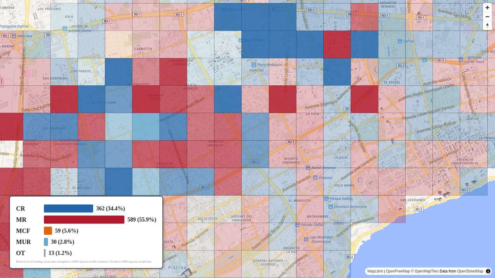

GEM Foundation, n.d.

---

<!-- _class: figure -->

# Methodology: Proposed workflow

Yepes-Estrada et al., 2023

---

# Results

---

<!-- _class: map -->

<!-- MAP:intro (static fallback) -->

---

<!-- _class: map -->

# Attribute tour

<!-- MAP:intro_attributes (static fallback) -->
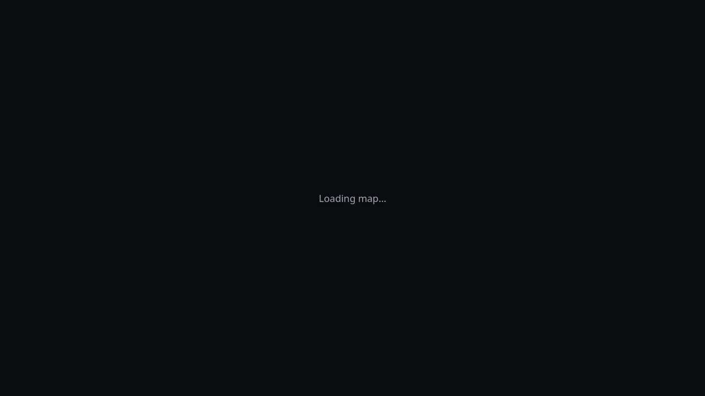

---

# Footprint geometry

<table style="border-collapse:collapse; width:100%;">
<thead>
<tr>
<th style="border:1px solid #999; padding:10px 18px;">Metric</th>
<th style="border:1px solid #999; padding:10px 28px;">Mask2Former</th>
<th style="border:1px solid #999; padding:10px 28px;">SAM2</th>
<th style="border:1px solid #999; padding:10px 28px;">Microsoft</th>
</tr>
</thead>
<tbody>
<tr>
<td style="border:1px solid #999; padding:10px 18px;">AJ</td>
<td style="border:1px solid #999; padding:10px 28px;">0.580</td>
<td style="border:1px solid #999; padding:10px 28px;">0.630</td>
<td style="border:1px solid #999; padding:10px 28px;">0.099</td>
</tr>
<tr>
<td style="border:1px solid #999; padding:10px 18px;">SBD</td>
<td style="border:1px solid #999; padding:10px 28px;">0.560</td>
<td style="border:1px solid #999; padding:10px 28px;">0.737</td>
<td style="border:1px solid #999; padding:10px 28px;">0.124</td>
</tr>
<tr>
<td style="border:1px solid #999; padding:10px 18px;">PQ</td>
<td style="border:1px solid #999; padding:10px 28px;">0.446</td>
<td style="border:1px solid #999; padding:10px 28px;">0.530</td>
<td style="border:1px solid #999; padding:10px 28px;">0.002</td>
</tr>
<tr>
<td style="border:1px solid #999; padding:10px 18px;">mAP</td>
<td style="border:1px solid #999; padding:10px 28px;">0.224</td>
<td style="border:1px solid #999; padding:10px 28px;">0.277</td>
<td style="border:1px solid #999; padding:10px 28px;">0.0003</td>
</tr>
<tr>
<td style="border:1px solid #999; padding:10px 18px;">sAP</td>
<td style="border:1px solid #999; padding:10px 28px;">0.370</td>
<td style="border:1px solid #999; padding:10px 28px;">0.526</td>
<td style="border:1px solid #999; padding:10px 28px;">0.044</td>
</tr>
</tbody>
</table>

Santo Domingo GT

Mask2Former

SAM2

Microsoft

<!-- Note: these AJ/SBD/PQ/mAP/sAP metric values are from the TFM deck's Guatemala benchmark (the only numbers available for this segmentation comparison); the four images above are the Santo Domingo equivalents. No slide-ref here: this segmentation benchmark isn't in the ECEE paper's reference list — it's the authors' own (unpublished) TFM comparison. -->

---

<!-- _class: map -->

<!-- MAP:height (static fallback) -->
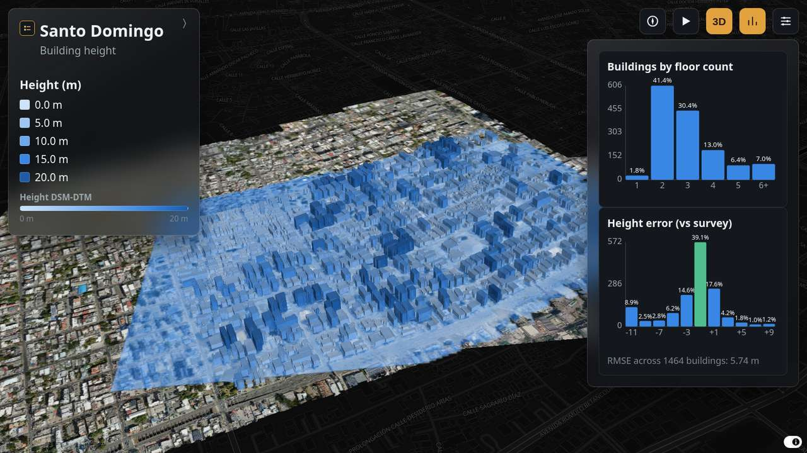

Zhu et al., 2025

---

<!-- _class: figure -->

# Relative position within a block

Ureña Pliego et al., 2025

---

<!-- _class: map -->

<!-- MAP:relative_position (static fallback) -->
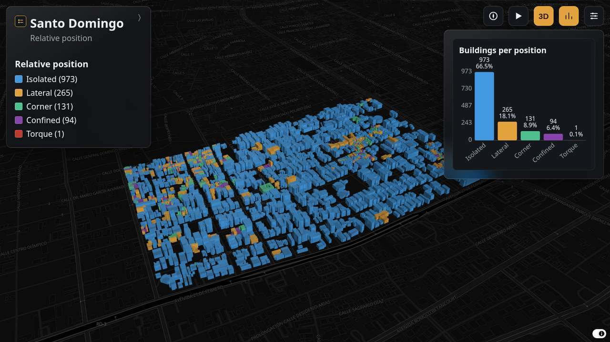

Ureña Pliego et al., 2025

---

<!-- _class: figure -->

# Footprint shape quantification

Ureña Pliego et al., 2025

---

<!-- _class: map -->

<!-- MAP:shape_parameters (static fallback) -->
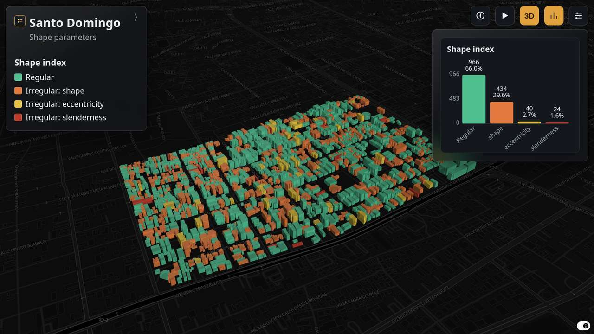

Ureña Pliego et al., 2025

---

<!-- _class: map -->

<!-- MAP:roof_material (static fallback) -->
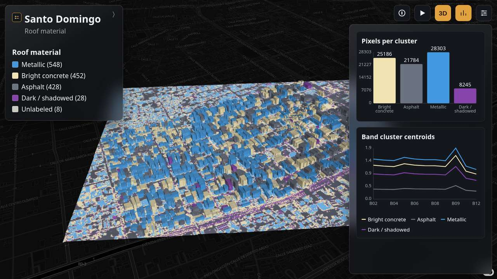

Torres et al., 2023

---

<!-- _class: map -->

<!-- MAP:year (static fallback) -->
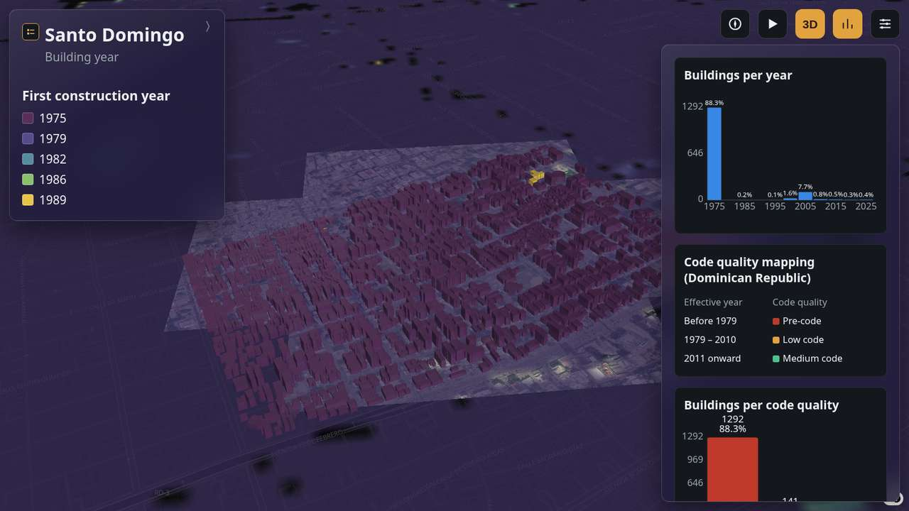

Marconcini et al., 2021

---

# Structural system

---

<!-- _class: map -->

<!-- MAP:structural_system_split (static fallback) -->
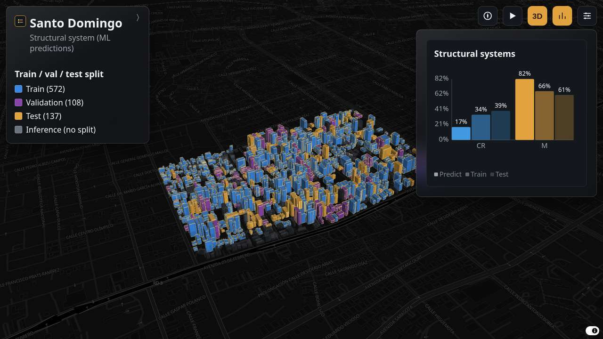

---

<!-- _class: map -->

<!-- MAP:structural_system_metrics (static fallback) -->
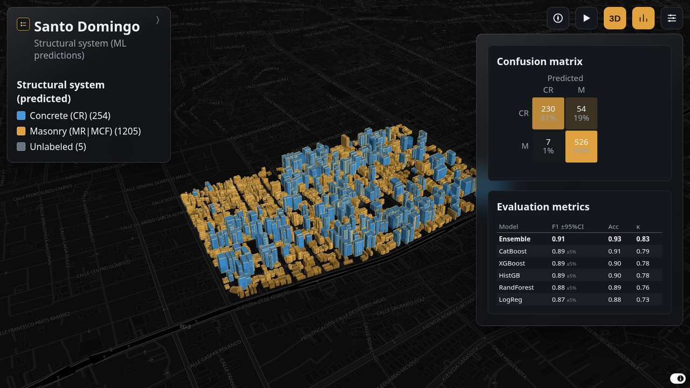

---

<!-- _class: map -->

<!-- MAP:structural_system_feature_importance (static fallback) -->
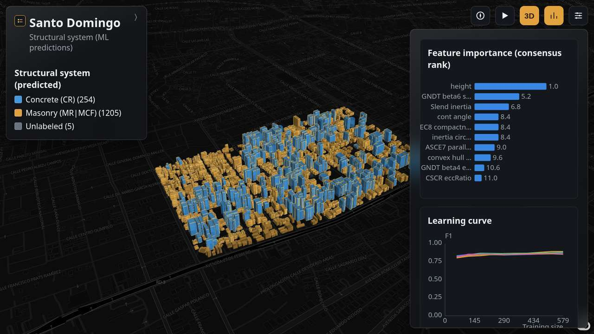

---

<!-- _class: map -->

<!-- MAP:structural_system_comparison (static fallback) -->
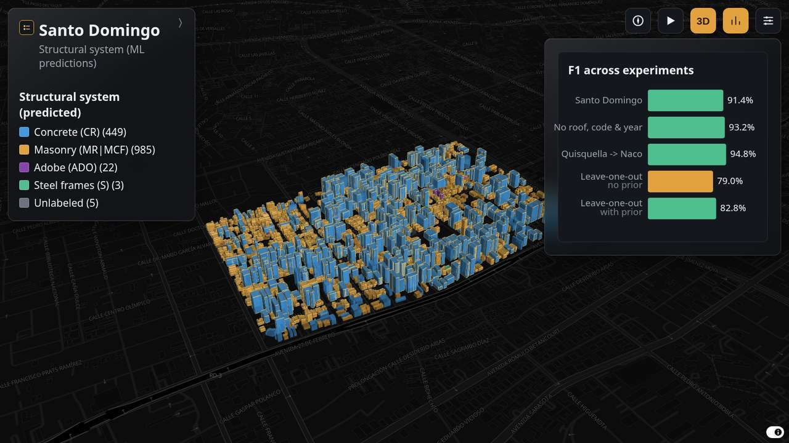

---

# Conclusion

<!-- MAP:gem_exposure (static fallback) -->

<!-- MAP:intro_conclusion (static fallback) -->
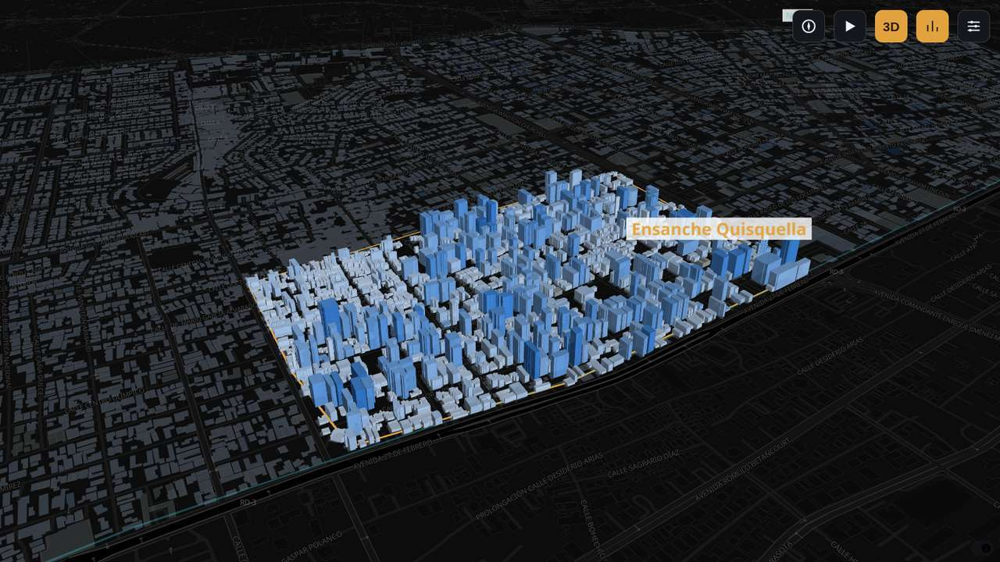

---

<!-- _class: refs -->

# References

Bishop, C. M. (2006). <em>Pattern recognition and machine learning</em>. Springer.

Brzev, S., Scawthorn, C., Silva, V., et al. (2013). <em>GEM building taxonomy version 2.0</em>. https://doi.org/10.13117/GEM.EXP-MOD.TR2013.02

GEM Foundation. (n.d.). <em>Dominican Republic exposure model</em> [Data set]. OpenQuake Global Risk Model. https://docs.openquake.org/global_risk_model/exposure/Caribbean_Central_America/Dominican_Republic/README.html

GeomaticsCaminosUPM. (n.d.). <em>SeismicBuildingExposure</em> [Computer software]. GitHub. https://github.com/GeomaticsCaminosUPM/SeismicBuildingExposure

Hollmann, N., Müller, S., et al. (2022). <em>TabPFN: A transformer that solves small tabular classification problems in a second</em>. https://doi.org/10.48550/arXiv.2207.01848

Hollmann, N., Müller, S., et al. (2025). Accurate predictions on small data with a tabular foundation model. <em>Nature</em>. https://doi.org/10.1038/s41586-024-08328-6

Jiménez-Martínez, M., Navas-Sánchez, L., et al. (2024). A methodology to assess and select seismic fragility curves: Calibration from expert survey and fuzzy analysis. <em>International Journal of Disaster Risk Reduction</em>. https://doi.org/10.1016/j.ijdrr.2024.104930

Marconcini, M., Esch, T., et al. (2021). Understanding current trends in global urbanisation: The World Settlement Footprint suite. <em>GI_Forum</em>. https://doi.org/10.1553/giscience2021_01_s33

Torres, Y., Martínez-Cuevas, S., et al. (2023). Using remote sensing for exposure and seismic vulnerability evaluation: Is it reliable? <em>International Journal of Remote Sensing</em>. https://doi.org/10.1080/15481603.2023.2196162

Torres-Olivares, S., et al. (2025). Numerical study on the seismic behavior of aggregate reinforced concrete block masonry buildings. <em>Bulletin of Earthquake Engineering</em>. https://doi.org/10.1007/s10518-025-02262-2

Ureña Pliego, M., Rodríguez Saiz, J., et al. (2025). <em>A methodology for the automated estimation of seismic behavior modifiers from building footprints</em> [Preprint]. SSRN. https://www.ssrn.com/abstract=5419010

Yepes-Estrada, C., Calderon, A., et al. (2023). Global building exposure model for earthquake risk assessment. <em>Earthquake Spectra</em>. https://doi.org/10.1177/87552930231194048

Zhu, X. X., Chen, S., Zhang, F., Shi, Y., &amp; Wang, Y. (2025). GlobalBuildingAtlas: An open global and complete dataset of building polygons, heights and LoD1 3D models. <em>Earth System Science Data</em>, <em>17</em>(12), 6647–6668. https://doi.org/10.5194/essd-17-6647-2025

---

<!-- _class: title -->
<!-- _paginate: false -->
<!-- _header: '' -->

<!-- Optional faded background map. Delete this one line to turn it off. -->
<iframe class="bg-map-frame" src="./maps/intro/index.html?view=attributes_noplot"></iframe>

# Thank you

Miguel Ureña-Pliego1,*, Javier Rodríguez-Saiz1,2, Javier Sempere-Hernández3, Beatriz Moya-García4,5, Sebastián Rodríguez-Iturra5, Francisco Chinesta4,5, Beatriz González-Rodrigo6, Miguel Marchamalo-Sacristán1,7

1 Departamento de Ingeniería y Morfología del Terreno, ETSICCP, Universidad Politécnica de Madrid, Spain
2 Buin Ingenieros, S.L. Madrid, Spain
3 Facultad de Ciencias, Universidad Nacional de Educación a Distancia, Spain
4 CNRS@CREATE LTD., Singapore
5 ENSAM Institute of Technology, Paris, France
6 Departamento de Ingeniería y Gestión Forestal, ETSIMFYMN, Universidad Politécnica de Madrid, Spain
7 Centro de I+D+i en Infraestructuras Inteligentes y Sostenibles (CIVILis), ETSICCP, Universidad Politécnica de Madrid, Spain
 * Corresponding author: Miguel Ureña-Pliego — <a href="mailto:miguel.urena@upm.es">miguel.urena@upm.es</a>

<!-- Fallback: if a live map iframe 404s, can't be fetched (offline), or is
     opened via file:// (maps need HTTP for their own fetch() calls), swap it
     for its pre-rendered GIF under figures/maps_gif/. Only active in this
     "live" presentation.md — the .static.md / .gif.md variants (built by
     scripts/build_presentation_variants.py) don't need it, they never embed
     a live iframe in the first place. -->

